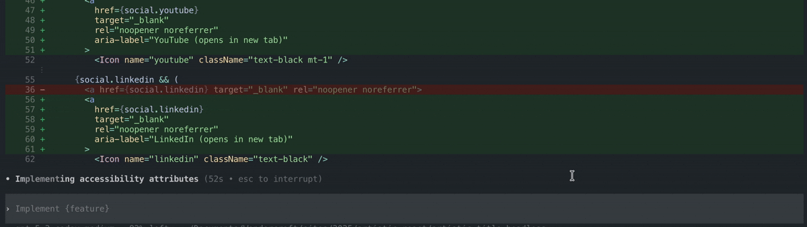
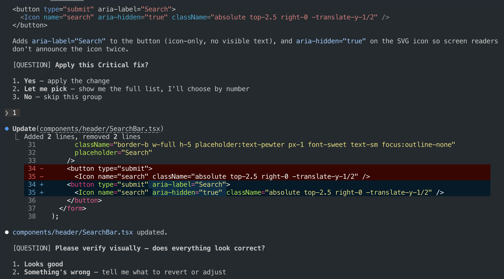

# a11y - Accessibility Audit & Remediation Skill

This skill executes comprehensive WCAG 2.2 AA audits and provides AI agents with targeted remediation blueprints. It is built following [skills best practices](https://platform.claude.com/docs/en/agents-and-tools/agent-skills/best-practices).

<p align="center">
  
</p>

## Why this Skill?

AI agents handle accessibility inconsistently without a defined workflow, often skipping fix validation or applying fixes without context. This skill takes your AI agent from scan to verified fix through structured remediation, reducing inaccuracies as much as possible.

| Capability                  | With a11y                                                                                                              | Without                                                                                          |
| :-------------------------- | :--------------------------------------------------------------------------------------------------------------------- | :----------------------------------------------------------------------------------------------- |
| **WCAG 2.2 AA Checks**      | ✅ axe-core runtime scan combined with a source code pattern scanner for issues axe cannot detect at runtime    | ❌ Basic checks without standardized finding structure.                     |
| **Fix Intelligence**        | ✅ Stack-aware remediation with code changes tailored to your codebase                                            | ❌ Code search from raw accessibility findings without remediation context                                                 |
| **Workflow Control**        | ✅ Structured flow with mandatory verification re-audit, explicit approval gates, and structured artifacts that minimize token usage | ❌ Unstructured fixes without controlled ordering, re-validation, or reusable context                  |
| **Audit Evidence**          | ✅ Produces formal deliverables (HTML dashboard, PDF compliance report, remediation guide) ready to share with stakeholders | ❌ No structured output, findings exist only within the chat session                             |

## Installation

Give your AI agent the install prompt, or use your agent's native skill installer.

```bash
"Install skill https://github.com/diegovelasquezweb/a11y"
```

The agent will clone the repository to its skills directory automatically:

| Agent | Install path | Install command |
| :---- | :----------- | :-------------- |
| Antigravity | `~/.gemini/antigravity/skills/a11y/` | `Install skill <repo-url>` |
| Claude Code | `~/.claude/skills/a11y/` | `Install skill <repo-url>` |
| Codex | `~/.codex/skills/a11y/` | `$skill-installer <repo-url>` |
| Cursor | `~/.cursor/skills/a11y/` | `Install skill <repo-url>` |
| Gemini CLI | `~/.gemini/skills/a11y/` | `gemini skills install <repo-url>` |
| Windsurf | `~/.codeium/windsurf/skills/a11y/` | `Install skill <repo-url>` |

Restart your agent session after installation to ensure the skill is loaded.

## How to Use

Give your AI agent the audit prompt, or use your agent's invoke shortcut.

```bash
"Audit accessibility localhost:3000"
```

The agent guides the rest of the session as a conversation, running the audit, presenting findings, walking you through fixes, and asking for your input at every decision point. Every action is confirmed before it runs.

<p align="center">
  
</p>

| Agent | Invoke shortcut | Audit command |
| :---- | :------------- | :------------ |
| Antigravity | `/a11y <url>` | `Audit accessibility <url>` |
| Claude Code | `/a11y <url>` | `Audit accessibility <url>` |
| Codex | `$a11y <url>` | `Audit accessibility <url>` |
| Cursor | `/a11y <url>` | `Audit accessibility <url>` |
| Gemini CLI | `--` | `Audit accessibility <url>` |
| Windsurf | `@a11y <url>` | `Audit accessibility <url>` |

## Deliverables

Visual reports on demand. You can optionally generate these formats:

| Deliverable           | Format  | Audience         | Key Value                                                                                                        |
| :-------------------- | :------ | :--------------- | :--------------------------------------------------------------------------------------------------------------- |
| **WCAG 2.2 AA Audit Dashboard**   | `.html` | Developers       | Interactive report with severity-grouped findings, DOM evidence, and ready-to-apply fix blueprints per component.  |
| **WCAG 2.2 AA Compliance Report** | `.pdf`  | Stakeholders     | Formal document with compliance score, legal risk summary, and remediation roadmap for non-technical audiences.  |
| **Manual Checklist**  | `.html` | Developers / QA  | Step-by-step guide for the WCAG criteria that automated tools cannot detect. |

## Technical Reference

For a comprehensive understanding of the a11y engine, explore the following technical manuals:

| Resource                                           | Description                                                                                         |
| :------------------------------------------------- | :-------------------------------------------------------------------------------------------------- |
| [Architecture](docs/architecture.md)               | How the three-stage pipeline transforms a URL into a surgical code fix roadmap.                     |
| [CLI Handbook](docs/cli-handbook.md)               | Every flag, execution path, and agent integration option for running the audit directly.            |
| [Engine Intelligence](docs/engine-intelligence.md) | How violations become actionable patches using the curated framework-aware knowledge base.          |
| [Source Scanner](docs/source-scanner.md)           | The code patterns that detect WCAG issues axe-core cannot find in the rendered DOM.                |
| [Scoring System](docs/scoring-system.md)           | The Weighted Debt Model that calculates compliance scores based on severity and frequency.          |
| [Engine Manifest](docs/engine-manifest.md)         | Complete inventory of every script, asset, and configuration file in the engine.                   |
| [Testing Strategy](docs/testing.md)                | Test suite structure and coverage across the scanner, analyzer, and intelligence mapping layers.    |

## External Resources

- [WCAG 2.2 Specification](https://www.w3.org/TR/WCAG22/)
- [Agent Skills Standard](https://agentskills.io/)
- [Claude Skills](https://docs.anthropic.com/en/docs/claude-code/skills)
- [Antigravity Skills](https://antigravity.google/docs/skills)
- [Codex Skills](https://developers.openai.com/codex/skills/)
- [Cursor Skills](https://cursor.com/docs/context/skills)
- [Gemini CLI Skills](https://geminicli.com/docs/cli/skills/)
- [Windsurf Skills](https://docs.windsurf.com/windsurf/cascade/skills)
