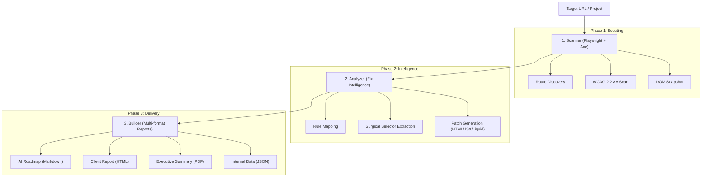
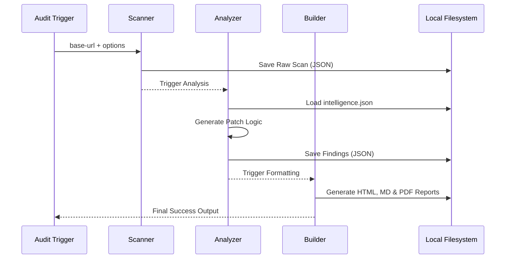

# Audit Engine Architecture

**Navigation**: [Home](../README.md) • [Architecture](architecture.md) • [CLI Handbook](cli-handbook.md) • [Configuration](configuration.md) • [Intelligence](engine-intelligence.md) • [Scoring](scoring-system.md) • [Testing](testing.md)

---

## Table of Contents

- [High-Level Pipeline](#high-level-pipeline)
- [Internal Component Roles](#internal-component-roles)
- [Data Flow Diagram](#data-flow-diagram)

The a11y skill operates as a three-stage pipeline designed for **Autonomous Remediation**. It transforms a URL into a surgical roadmap of code fixes.

## High-Level Pipeline

## Internal Component Roles

### 1. The Scanner (`run-scanner.mjs`)

- **Engine**: Uses Playwright to emulate a real user environment (Light/Dark mode, Viewport).
- **Compliance**: Injects `axe-core` to run 90+ accessibility rules.
- **Discovery**: Crawls the site starting from the `base-url` up to `max-routes`.
- **Output**: Generates a raw `a11y-scan-results.json` containing every violation found in the DOM.

### 2. The Analyzer (`run-analyzer.mjs`)

- **Brain**: Consumes the raw scan results and enriches them using `assets/intelligence.json`.
- **Fix Logic**: Generates the `fixCode`, `fixDescription`, `wcag_criterion_id`, and `framework_notes` for each finding.
- **Precision**: Extracts the "Search Hint" (ID, Class, or Tag) to help AI agents find the code in the source files.
- **Triage**: Maps axe-core impact levels to severity tiers (Critical / High / Medium / Low). Compliance score calculation happens downstream in `core-findings.mjs`.

### 3. The Builder (`run-audit.mjs` orchestrator)

- **Assembly**: Coordinates the execution of the Scanner and Analyzer.
- **Formatting**: Triggers all three report builders: `build-report-html.mjs`, `build-report-md.mjs`, and `build-report-pdf.mjs`.
- **Persistence**: Ensures the `audit/` folder is updated with the latest findings.

## Data Flow Diagram

