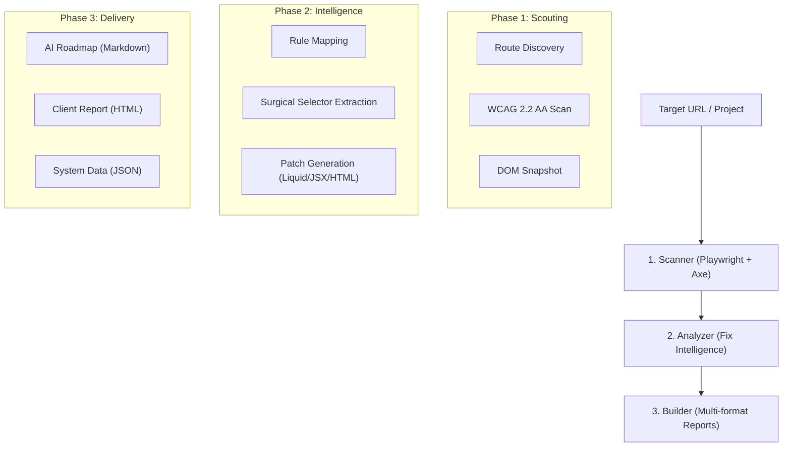
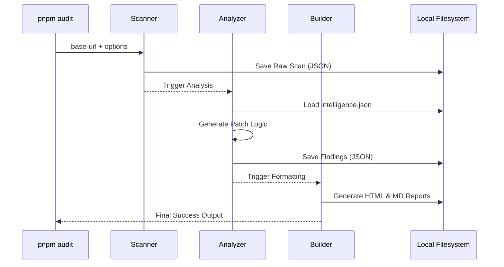

# Audit Engine Architecture

The a11y skill operates as a three-stage pipeline designed for **Autonomous Remediation**. It transforms a URL into a surgical roadmap of code fixes.

## High-Level Pipeline

## Internal Component Roles

### 1. The Scanner (`run-scanner.mjs`)

- **Engine**: Uses Playwright to emulate a real user environment (Light/Dark mode, Viewport).
- **Compliance**: Injects `axe-core` to run 90+ accessibility rules.
- **Discovery**: Crawls the site starting from the `base-url` up to `max-routes`.
- **Output**: Generates a raw `a11y-scan-results.json` containing every violation found in the DOM.

### 2. The Analyzer (`run-analyzer.mjs`)

- **Brain**: Consumes the raw scan results and enriches them using `assets/intelligence.json`.
- **Fix Logic**: Generates the `fixCode` and `fixDescription` for each finding.
- **Precision**: Extracts the "Search Hint" (ID, Class, or Tag) to help AI agents find the code in the source files.
- **Triage**: Calculates weighted scores and severity levels.

### 3. The Builder (`run-audit.mjs` orchestrator)

- **Assembly**: Coordinates the execution of the Scanner and Analyzer.
- **Formatting**: Triggers the report builders (`build-report-html.mjs` and `build-report-md.mjs`).
- **Persistence**: Ensures the `audit/` folder is updated with the latest findings.

## Data Flow Diagram

