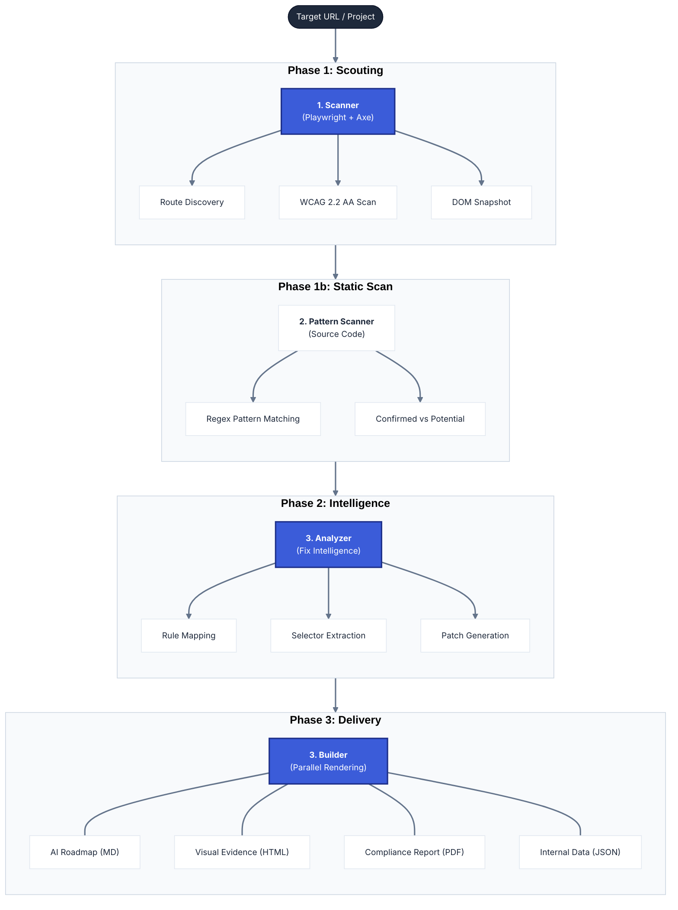
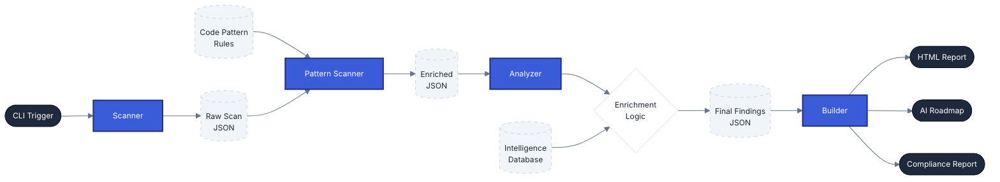
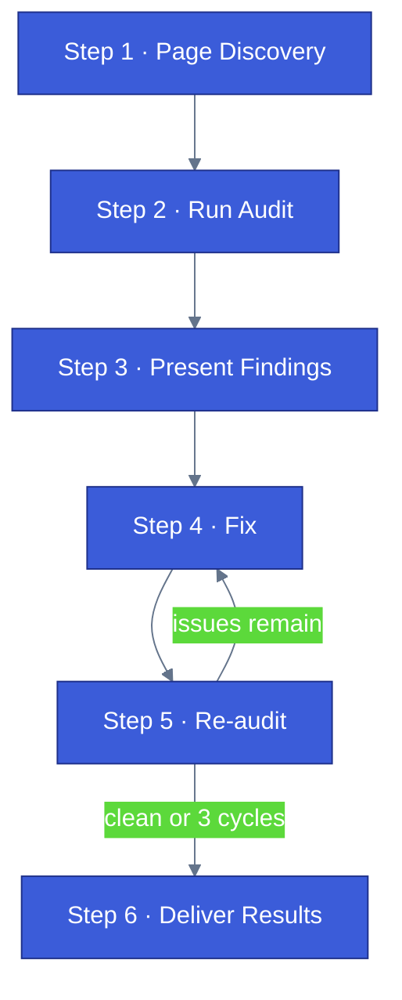

# Audit Engine Architecture

**Navigation**: [Home](../README.md) • [Architecture](architecture.md) • [CLI Handbook](cli-handbook.md) • [Intelligence](engine-intelligence.md) • [Source Scanner](source-scanner.md) • [Scoring](scoring-system.md) • [Manifest](engine-manifest.md) • [Testing](testing.md)

---

## Table of Contents

- [High-Level Pipeline](#high-level-pipeline)
- [Internal Component Roles](#internal-component-roles)
- [Data Flow Diagram](#data-flow-diagram)
- [Conversation Flow](#conversation-flow)

The a11y skill operates as a three-stage pipeline. It transforms a URL into an actionable remediation roadmap, prioritizing structured findings and targeted fix guidance over passive reporting.

## High-Level Pipeline

## Internal Component Roles

### 1. The Scanner (`dom-scanner.mjs`)

- **Engine**: Uses Playwright to emulate a real user environment (Light/Dark mode, Viewport).
- **Compliance**: Injects `axe-core` 4.11.1 to run WCAG 2.2 A/AA rules across all discovered routes.
- **Discovery**: If the site has a `sitemap.xml`, all listed URLs are scanned. Otherwise, BFS multi-level crawl starting from `base-url`, configurable via `--crawl-depth` (1-3, default: 2), capped at `maxRoutes` (default: 10).
- **Parallel Scanning**: Routes are scanned across 3 concurrent browser tabs for ~2-3x faster throughput.
- **Smart Wait**: Uses the configured Playwright load strategy (`domcontentloaded` by default, configurable via `--wait-until`) plus `waitMs` as a post-load settle delay.
- **Project Context Detection**: Auto-detects modern frameworks from `package.json`, detects structural platforms (Shopify, WordPress, Drupal) from project directories, and detects UI component libraries from `package.json`.
- **Output**: Generates a raw `a11y-scan-results.json` containing every violation found in the DOM plus the detected `projectContext`.

### 2. The Pattern Scanner (`source-scanner.mjs`)

- **Purpose**: Detects accessibility issues that axe-core cannot find via DOM inspection — such as suppressed focus outlines, placeholder-only form labels, or missing skip links in source code.
- **Input**: Requires `--project-dir` pointing to the project source. If not provided, this stage is skipped.
- **Detection**: Runs regex patterns against source files (`.tsx`, `.jsx`, `.css`, `.scss`, etc.) defined in `assets/remediation/code-patterns.json`. Each pattern targets a specific WCAG criterion.
- **Confidence levels**: Marks each match as `confirmed` (no mitigating code found nearby) or `potential` (a context reject pattern was found within the configured context window).
- **Output**: Appends pattern findings to `a11y-findings.json` under a `patternFindings` key, grouped by `pattern_id`.

### 3. The Analyzer (`analyzer.mjs`)

- **Brain**: Consumes the raw scan results and enriches them using `assets/remediation/intelligence.json`.
- **Fix Logic**: Generates the `fixCode`, `fixDescription`, and the relevant stack-specific notes (`framework_notes` / `cms_notes`) for each finding.
- **Precision**: Extracts a precise CSS selector (prioritizing ID > Short Path) and generates a search hint to help AI agents find the code in the source files.
- **Fix Acceleration**: Uses the detected `projectContext` to generate per-finding:
  - `file_search_pattern` — stack-aware source boundary patterns (e.g., `app/**/*.tsx` for Next.js or `wp-content/themes/**/*.php` for WordPress) so agents search the right directories.
  - `managed_by_library` — warns when an ARIA rule violation may be on a component managed by a UI library (Radix, Headless UI, etc.).
  - `component_hint` — extracts the likely component name from the CSS selector (e.g., `.product-card__title` → `product-card`) for batch fixing.
  - `verification_command` — a targeted re-scan command (`--routes` + `--only-rule`) for quick post-fix verification.
  - `ownership_status` / `search_strategy` — tells the agent whether the finding looks editable in the primary source of truth, outside that boundary, or still needs ownership confirmation before searching.
- **Triage**: Maps axe-core impact levels to severity tiers (Critical / Serious / Moderate / Minor). Compliance score calculation happens downstream in `findings.mjs`.

### 3. The Builder (`audit.mjs` orchestrator)

- **Assembly**: Coordinates the execution of the Scanner and Analyzer.
- **Formatting**: Triggers the report builders (HTML dashboard, Markdown remediation guide, PDF summary).
- **Persistence**: Stores all pipeline artifacts in the skill's internal directory.

### 4. The Remediation Guide (internal `remediation.md`)

The Markdown report is the primary interface between the audit engine and the AI agent fixing issues. It includes:

- **Fixes by Component** table — groups findings by extracted component name so the agent can batch edits per file.
- **Search in** — stack-aware source boundary patterns per finding, derived from the detected project context.
- **Managed Component Warning** — alerts the agent when a finding's ARIA rule may be handled by a UI library.
- **Quick verify** — a targeted re-scan command per finding for post-fix verification in seconds instead of minutes.
- **Stack-aware guardrails** — uses the detected stack (not just generic defaults) to generate project-specific instructions.
- **Ownership guidance** — warns when a finding appears outside the primary editable source or still needs confirmation before the agent searches for files.

## Data Flow Diagram

## Conversation Flow

The 6-step agent workflow orchestrated by `SKILL.md`. Steps 4 and 5 loop until issues are resolved or 3 cycles are exhausted.

