# Audit Engine Architecture

**Navigation**: [Home](../README.md) • [Architecture](architecture.md) • [CLI Handbook](cli-handbook.md) • [Configuration](configuration.md) • [Intelligence](engine-intelligence.md) • [Scoring](scoring-system.md) • [Testing](testing.md)

---

## Table of Contents

- [High-Level Pipeline](#high-level-pipeline)
- [Internal Component Roles](#internal-component-roles)
- [Data Flow Diagram](#data-flow-diagram)

The a11y skill operates as a three-stage pipeline designed for **Autonomous Remediation**. It transforms a URL into a surgical roadmap of code fixes, prioritizing action over passive reporting.

## High-Level Pipeline

## Internal Component Roles

### 1. The Scanner (`run-scanner.mjs`)

- **Engine**: Uses Playwright to emulate a real user environment (Light/Dark mode, Viewport).
- **Compliance**: Injects `axe-core` to run 106 accessibility rules (100% of axe-core WCAG A/AA + best-practice coverage).
- **Discovery**: BFS multi-level crawl starting from `base-url`, configurable via `--crawl-depth` (1-3, default: 2). Supplements sitemap routes if the `maxRoutes` budget is not filled.
- **Parallel Scanning**: Routes are scanned across 3 concurrent browser tabs for ~2-3x faster throughput.
- **Smart Wait**: Uses `networkidle` signal instead of a fixed delay — proceeds as soon as the page is ready, with `waitMs` as the timeout ceiling.
- **Project Context Detection**: Auto-detects the project's framework (Next.js, Nuxt, React, Vue, Angular, Astro, Svelte, Shopify, WordPress) from DOM signals, and UI component libraries (Radix, Headless UI, Chakra, Mantine, Material UI) from `package.json`.
- **Output**: Generates a raw `a11y-scan-results.json` containing every violation found in the DOM plus the detected `projectContext`.

### 2. The Analyzer (`run-analyzer.mjs`)

- **Brain**: Consumes the raw scan results and enriches them using `assets/intelligence.json`.
- **Fix Logic**: Generates the `fixCode`, `fixDescription`, `wcag_criterion_id`, and `framework_notes` for each finding.
- **Precision**: Extracts the "Search Hint" (ID, Class, or Tag) to help AI agents find the code in the source files.
- **Fix Acceleration**: Uses the detected `projectContext` to generate per-finding:
  - `file_search_pattern` — framework-specific glob patterns (e.g., `app/**/*.tsx` for Next.js) so agents search the right directories.
  - `managed_by_library` — warns when an ARIA rule violation may be on a component managed by a UI library (Radix, Headless UI, etc.).
  - `component_hint` — extracts the likely component name from the CSS selector (e.g., `.product-card__title` → `product-card`) for batch fixing.
  - `verification_command` — a targeted re-scan command (`--routes` + `--only-rule`) for quick post-fix verification.
- **Triage**: Maps axe-core impact levels to severity tiers (Critical / High / Medium / Low). Compliance score calculation happens downstream in `core-findings.mjs`.

### 3. The Builder (`run-audit.mjs` orchestrator)

- **Assembly**: Coordinates the execution of the Scanner and Analyzer.
- **Formatting**: Triggers the report builders (HTML dashboard, Markdown remediation guide, PDF summary).
- **Persistence**: Ensures the `audit/` folder is updated with the latest findings.

### 4. The Remediation Guide (`audit/remediation.md`)

The Markdown report is the primary interface between the audit engine and the AI agent fixing issues. It includes:

- **Fixes by Component** table — groups findings by extracted component name so the agent can batch edits per file.
- **Search in** — framework-specific glob patterns per finding, derived from the detected project context.
- **Managed Component Warning** — alerts the agent when a finding's ARIA rule may be handled by a UI library.
- **Quick verify** — a targeted re-scan command per finding for post-fix verification in seconds instead of minutes.
- **Framework-aware guardrails** — uses the detected framework (not just URL heuristics) to generate project-specific instructions.

## Data Flow Diagram

```mermaid
%%{init: { 'theme': 'base', 'themeVariables': { 'primaryColor': '#3b5cd9', 'primaryTextColor': '#1e293b', 'secondaryColor': '#f1f5f9', 'tertiaryColor': '#fff', 'mainBkg': '#fff', 'nodeBorder': '#e2e8f0', 'actorTextColor': '#1e293b', 'noteTextColor': '#1e293b', 'signalColor': '#3b5cd9', 'signalTextColor': '#1e293b' } } }%%
sequenceDiagram
    autonumber
    participant CLI as 🖥️ Audit Trigger
    participant S as 🔍 Scanner
    participant A as 🧠 Analyzer
    participant B as 🏗️ Builder
    participant FS as 📂 Local Filesystem

    CLI->>S: base-url + options
    Note over S,FS: Emulates Browser
    S->>FS: Save Raw Scan (JSON)
    S-->>A: Trigger Analysis
    A->>FS: Load intelligence.json
    rect rgb(241, 245, 249)
        Note right of A: Context-Aware Logic
        A->>A: Generate Patch Logic
    end
    A->>FS: Save Findings (JSON)
    A-->>B: Trigger Formatting
    B->>FS: Generate HTML, MD & PDF
    B-->>CLI: Final Success Output
```

