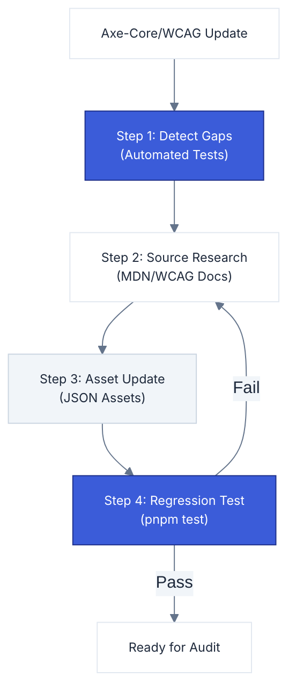

# Data Validation Guide

**Navigation**: [Home](../README.md) • [Architecture](architecture.md) • [CLI Handbook](cli-handbook.md) • [Configuration](configuration.md) • [Data Validation](data-validation.md) • [Intelligence](engine-intelligence.md) • [Scoring](scoring-system.md) • [Scripts](scripts-catalog.md) • [Testing](testing.md)

---

This document describes the process for validating and updating the intelligence data that powers the `a11y` skill. Follow this guide whenever rules are added, `axe-core` is upgraded, or WCAG specifications change.

## Validation Lifecycle



---

## Official Sources (by reliability)

> [!NOTE]
> Always prioritize the WCAG specification as the "Ground Truth". Secondary sources like MDN are excellent for implementation details but may lag behind spec changes.

1.  **WCAG 2.2 Specification** — [w3.org/TR/WCAG22](https://www.w3.org/TR/WCAG22/)
2.  **WCAG Understanding Docs** — [w3.org/WAI/WCAG22/Understanding](https://www.w3.org/WAI/WCAG22/Understanding/)
3.  **axe-core Rule Metadata** — `node_modules/axe-core/axe.js` via `getRules()`
4.  **W3C ARIA APG** — [w3.org/WAI/ARIA/apg](https://www.w3.org/WAI/ARIA/apg/)
5.  **MDN Web Docs** — [developer.mozilla.org](https://developer.mozilla.org)

## Files to Validate

| File                        | Technical Scope                                                              |
| :-------------------------- | :--------------------------------------------------------------------------- |
| `assets/rule-metadata.json` | `wcagCriterionMap`, URLs (`mdn`, `apgPatterns`), `impactedUsers`, `expected` |
| `assets/intelligence.json`  | `fix.description`, `fix.code`, `framework_notes`, `false_positive_risk`      |
| `assets/manual-checks.json` | `criterion` mapping, `steps`, `remediation`, `code_example`                  |

---

## Step 1: Detect Gaps (Automated)

The test suite automatically identifies inconsistencies between `axe-core` and our internal intelligence data.

```bash
pnpm test
```

> [!IMPORTANT]
> When `axe-core` is upgraded, look for:
>
> - **New Rules**: Rules added to the engine that lack intelligence mapping.
> - **Changed Mappings**: WCAG tags that have evolved (e.g., A -> AA).
> - **Stale Rules**: Rules deprecated by Axe that should be removed from our assets.

## Step 2: Validate Intelligence Content

Consult the **WCAG Understanding** page for each rule to verify:

1.  **`fix.description`**: Is it technically accurate per the spec?
2.  **`fix.code`**: Does it follow WCAG recommended techniques?
3.  **`framework_notes`**: Is it compatible with modern frameworks (React 19+, Vue 3+)?
4.  **`false_positive_risk`**: Does it reflect actual Axe-core edge cases?

## Step 3: Validate URLs (Semi-Automated)

> [!WARNING]
> MDN slugs and W3C draft URLs change frequently. Broken links in the "AI Roadmap" significantly degrade the experience for agents.

Ensure all URLs in `rule-metadata.json` and `manual-checks.json` return a `200 OK` status.

## Step 4: Regression Testing

After updates, ensure the entire pipeline remains healthy. The test suite validates:

- **Schema Integrity**: Required fields and data types.
- **Reciprocity**: If Rule A links to Rule B, Rule B must link back to Rule A.
- **Criterion Mapping**: Every intelligence entry must have a valid WCAG criterion ID.
- **Zero Stale Rules**: No rules in our data that don't exist in the current `axe-core` version.
