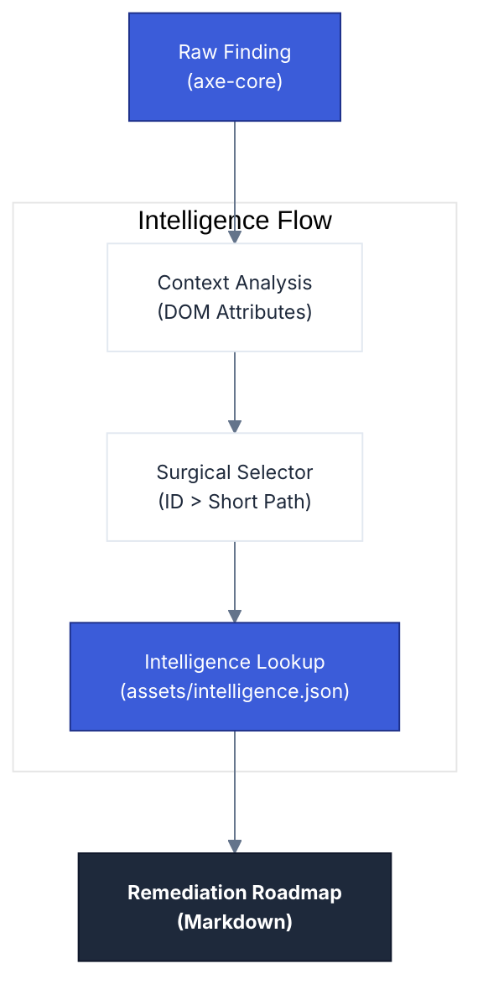

# Engine Intelligence

**Navigation**: [Home](../README.md) • [Architecture](architecture.md) • [CLI Handbook](cli-handbook.md) • [Configuration](configuration.md) • [Data Validation](data-validation.md) • [Intelligence](engine-intelligence.md) • [Scoring](scoring-system.md) • [Scripts](scripts-catalog.md) • [Testing](testing.md)

---

## Table of Contents

- [The Intelligence Database](#the-intelligence-database-assetsintelligencejson)
- [Surgical Patch Generation](#surgical-patch-generation)
- [Manual Checks](#manual-checks-assetsmanual-checksjson)

The "Intelligence" of the a11y skill revolves around **Autonomous Remediation**. It transforms a diagnostic finding into an actionable code patch.

## The Intelligence Edge: Skill vs. Standard Scanners

Standard automated scanners (like Axe-Core) typically detect only **30-50%** of accessibility issues. This skill extends that coverage to reach **WCAG 2.2 AA** and real-world usability standards.

| Feature                      | Standard Scanner |        **a11y Skill**         |
| :--------------------------- | :--------------: | :---------------------------: |
| **Automated Rules**          |       ~90        |             ~100              |
| **WCAG 2.2 AA Coverage**     | ❌ None/Partial  |   ✅ **Full (24+ Checks)**    |
| **Surgical Remediation**     |      ❌ No       |    ✅ **Direct Patching**     |
| **Multi-Framework Logic**    |      ❌ No       |  ✅ **React, Vue, Astro...**  |
| **Screen Reader (AT) Tests** |      ❌ No       |   ✅ **8 Behavioral Tests**   |
| **Contextual Evidence**      |      ❌ No       | ✅ **outerHTML Verification** |

## The Intelligence Database (`assets/intelligence.json`)

The skill ships with a curated knowledge base that map common accessibility violations to specific remediation patterns for modern frameworks (**Shopify**, **React**, **Next.js**, **Vue**, **Angular**).

### Core Intelligence Fields

For every rule (e.g., `image-alt`), the engine provides:

- **`fix.description`**: A human-friendly explanation of _what_ to do.
- **`fix.code`**: A "surgical" code snippet (HTML/JSX/Liquid) that demonstrates the fix.
- **`framework_notes`**: Platform-specific advice for React, Vue, and Angular.
- **`effort`**: Estimated implementation effort (`low` / `medium` / `high`).
- **`impacted_users`**: Who benefits from this specific fix.
- **`false_positive_risk`**: Calibrated confidence level (`low` / `medium` / `high`). Medium/high triggers a warning badge in the report so agents verify before applying a fix.
- **`fix_difficulty_notes`**: Edge cases and caveats beyond the obvious fix (e.g., label-vs-placeholder tradeoffs, voice control conflicts).
- **`related_rules`**: Linked rule IDs commonly resolved together, with the reason why (e.g., `label` → `autocomplete-valid`).
- **`wcag_techniques`**: Official W3C technique IDs (e.g., `H37`, `ARIA14`) referenced per rule.
- **`affected_at`**: Assistive technologies impacted (JAWS, NVDA, VoiceOver, TalkBack, Voice Control, etc.).
- **`manual_test`**: Steps for verifying findings that axe-core cannot fully automate.
- **`mdn`**: Direct MDN Web Docs link for the relevant HTML element or ARIA attribute.

### WCAG Criterion Map (`wcagCriterionMap`)

A top-level lookup in `intelligence.json` that maps every rule ID to its WCAG criterion number (e.g., `"image-alt" → "1.1.1"`). The analyzer injects `wcag_criterion_id` into every finding using this map — no per-rule duplication required.

## Surgical Patch Generation

When a violation is found, the Analyzer does more than just report it — it provides the exact intelligence needed to locate the issue in the codebase with surgical precision.

### 1. The Surgical Selector

The engine processes raw DOM selectors from the scanner into a **Surgical Selector** using a "best candidate" heuristic:

- **ID Priority**: If an element has an `id`, it is used as the primary selector. IDs are the most stable point of entry for code remediation.
- **Direct vs Verbose**: In the absence of an ID, the engine simplifies complex CSS paths into the shortest possible direct selector (e.g., `div > p` instead of `html > body > main > div > div > p`) to reduce fragility.
- **Search Hint**: The selector is further translated into a **Search Hint** (e.g., `<img` or `id="submit-btn"`) designed for rapid source code discovery via `grep` or IDE search.

### 2. Evidence from DOM (The Correctness Guarantee)

To prevent "hallucinations" or incorrect patching, the engine captures the **HTML Evidence** (outerHTML) of the failing element.

- **Verification**: AI agents must compare the captured `html` snippet with the code they find in the source file. If the HTML does not match, the agent knows the selector may be stale or pointing to a different component.
- **Contextual Fixes**: Having the real DOM state allows the agent to understand the current attribute values (like a missing `alt` or a misconfigured `aria-label`) before proposing a change.

### 3. Pipeline Overview

```mermaid
%%{init: { 'theme': 'base', 'themeVariables': { 'primaryColor': '#3b5cd9', 'primaryTextColor': '#1e293b', 'primaryBorderColor': '#1e308a', 'lineColor': '#64748b', 'secondaryColor': '#f1f5f9', 'tertiaryColor': '#fff', 'mainBkg': '#fff', 'nodeBorder': '#e2e8f0' } } }%%
flowchart TD
    Finding["Raw Finding<br/>(axe-core)"]

    subgraph Analysis ["Intelligence Flow"]
        direction TB
        Context["Context Analysis<br/>(DOM Attributes)"]
        Hint["Surgical Selector<br/>(ID > Short Path)"]
        Match["Intelligence Lookup<br/>(assets/intelligence.json)"]
    end

    Roadmap["<b>Remediation Roadmap</b><br/>(Markdown)"]

    Finding --> Context
    Context --> Hint
    Hint --> Match
    Match --> Roadmap

    classDef default font-family:Inter,sans-serif,font-size:12px;
    classDef core fill:#3b5cd9,color:#fff,stroke:#1e308a;
    classDef roadmap fill:#1e293b,color:#fff,stroke:#0f172a,font-weight:bold;

    class Finding,Match core;
    class Roadmap roadmap;
```

## Example: The "Fix-First" Flow

If an image is missing alt text:

- **Scanner**: Detects `img` missing `alt`.
- **Analyzer**:
  - Identifies `ruleId: image-alt`.
  - Extracts selector: `div.hero > img`.
  - Generates search hint: ``.
- **Roadmap**: Tells the AI: _"Search for `<img` inside the Hero component and add an `alt` attribute."_

## Manual Checks (`assets/manual-checks.json`)

axe-core is an automated tool — it cannot verify criteria that require human judgment or live assistive technology interaction. The skill ships a second knowledge base, `assets/manual-checks.json`, with **24 checks** covering WCAG 2.2 AA criteria and screen reader behavior that automation cannot assess.

These checks are appended as a dedicated section — **"WCAG 2.2 Static Code Checks"** — at the end of every `remediation.md` report.

### What each check contains

| Field          | Description                                                                            |
| :------------- | :------------------------------------------------------------------------------------- |
| `criterion`    | WCAG 2.2 criterion number (e.g., `"2.4.11"`) or screen reader test ID (e.g., `"AT-1"`) |
| `title`        | Human-readable criterion name                                                          |
| `level`        | WCAG conformance level (`A` or `AA`)                                                   |
| `description`  | What the criterion requires and why it matters                                         |
| `steps`        | Step-by-step verification instructions for a human or agent                            |
| `remediation`  | Recommended fix patterns if a violation is found                                       |
| `code_example` | Optional before/after code snippet (`lang`, `before`, `after`)                         |
| `ref`          | Canonical W3C understanding document URL                                               |

### Coverage breakdown

**WCAG 2.2 New Criteria (AA):** Focus Appearance (2.4.11), Dragging Movements (2.5.7), Target Size Minimum (2.5.8), Consistent Help (3.2.6), Redundant Entry (3.3.7), Accessible Authentication (3.3.8)

**Interactive Behavior (axe blind spots):** Keyboard Access (2.1.1), No Keyboard Trap (2.1.2), Focus Order (2.4.3), Content on Hover or Focus (1.4.13), Animation from Interactions (2.3.3)

**Perception:** Use of Color (1.4.1), Reflow (1.4.10), Non-text Contrast (1.4.11), Text Spacing (1.4.12), Error Identification (3.3.1)

**Screen Reader (AT-1 → AT-8):** Heading navigation, landmark navigation, form labels, interactive element activation, live region announcements, modal dialog behavior, table reading, form error announcement

### How to add a new manual check

Add an entry to `assets/manual-checks.json`. No code changes required — `build-report-md.mjs` reads the file at build time and injects all checks automatically.

## Reference Links

The engine provides deep-links to industry standards for every finding:

- **WAI-ARIA Patterns (APG)**: Best practices for widget behavior, injected by ARIA role detected in the DOM.
- **MDN Web Docs**: Technical documentation for HTML elements and ARIA attributes.
- **Inclusive Components**: Accessible UI design patterns by Heydon Pickering.
- **a11ySupport**: Browser and assistive technology support data per ARIA role.
