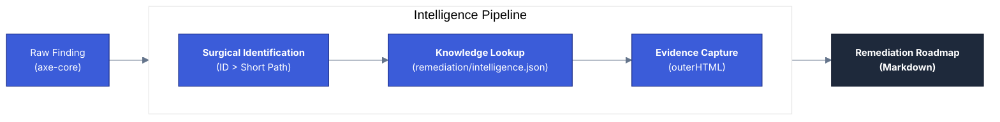

# Engine Intelligence

**Navigation**: [Home](../README.md) • [Architecture](architecture.md) • [CLI Handbook](cli-handbook.md) • [Intelligence](engine-intelligence.md) • [Scoring](scoring-system.md) • [Manifest](engine-manifest.md) • [Testing](testing.md)

---

## Table of Contents

- [The Intelligence Database](#the-intelligence-database-assetsremediationintelligencejson)
- [Surgical Patch Generation](#surgical-patch-generation)
- [Manual Checks](#manual-checks-assetsreportingmanual-checksjson)

The "Intelligence" of the a11y skill revolves around **Autonomous Remediation**. It transforms a diagnostic finding into an actionable code patch.

## The Intelligence Database (`assets/remediation/intelligence.json`)

The skill ships with a curated knowledge base that map common accessibility violations to specific remediation patterns for modern frameworks (**Shopify**, **React**, **Next.js**, **Vue**, **Angular**).

### Core Intelligence Fields

For every rule (e.g., `aria-dialog-name`), the engine provides a roadmap for the **AI Agent** to execute the fix:

- **`category`**: The axe-core issue category (`aria`, `forms`, `keyboard`, `structure`, `semantics`, `name-role-value`, `tables`, `color`, `text-alternatives`, `language`, `parsing`, `sensory`). Used by the agent to group findings when the user selects "Fix by category" in Step 3.
- **`fix.description`**: The primary remediation strategy. The agent should use this to understand the high-level goal before looking at the code.
- **`fix.code`**: A surgical code snippet. The agent should treat this as a structural template for the patch, adapting it to the specific variable names and context of the source file.
- **`framework_notes`**: Platform-specific logic for **React**, **Vue**, **Angular**, **Svelte**, and **Astro**. The analyzer filters this to the detected framework before writing it to the remediation guide — the agent only ever sees the one relevant note.
- **`managed_by_libraries`**: A list of UI libraries (e.g., `radix`, `chakra`, `headless-ui`) that manage this ARIA concern automatically. The scanner detects which libraries the project uses at runtime; the analyzer cross-references that list against `managed_by_libraries`. If there is a match, a **Managed Component Warning** appears in the remediation guide — the agent does not perform this detection manually.
- **`guardrails_overrides`**: Rule-specific MUST / MUST_NOT / VERIFY instructions that override or extend the global remediation intelligence in `assets/remediation/global-remediation-intelligence.json`. Present only for rules with a meaningful false-positive risk or a specific constraint the agent must enforce (e.g., "do not remove `outline: none` if a `:focus-visible` replacement already exists").
- **`cms_notes`**: Environment-specific constraints for **Shopify**, **WordPress**, and **Drupal**. The analyzer filters this to the detected CMS before writing it to the remediation guide — the agent only sees the note for the active platform.
- **`false_positive_risk`**: Confidence level (`low` / `medium` / `high`). If `high`, the agent must prioritize manual verification and look for existing patterns that might satisfy the rule in a non-standard way.
- **`fix_difficulty_notes`**: Edge cases and caveats. The agent must read this to avoid "blind fixing" (e.g., knowing that a missing label might be an intentional design trade-off requiring a different ARIA approach).
- **`related_rules`**: Linked rule IDs with reciprocal references. If the agent is fixing a rule, it should proactively check if related rules are also failing to ensure the affected component is fully remediated in one pass. All relationships are bidirectional — if A links to B, B links back to A.

## Surgical Patch Generation

When a violation is found, the Analyzer does more than just report it — it provides the exact intelligence needed to locate the issue in the codebase with surgical precision.

### 1. The Surgical Selector

The engine processes raw DOM selectors from the scanner into a **Surgical Selector** using a "best candidate" heuristic:

- **ID Priority**: If an element has an `id`, it is used as the primary selector. IDs are the most stable point of entry for code remediation.
- **Direct vs Verbose**: In the absence of an ID, the engine simplifies complex CSS paths into the shortest possible direct selector (e.g., `div > p` instead of `html > body > main > div > div > p`) to reduce fragility.
- **Search Hint**: The selector is further translated into a **Search Hint** (e.g., `<img` or `id="submit-btn"`) designed for rapid source code discovery via `grep` or IDE search.

### 2. Evidence from DOM (The Correctness Guarantee)

To prevent "hallucinations" or incorrect patching, the engine captures the **HTML Evidence** (outerHTML) of the failing element.

- **Verification**: AI agents must compare the captured `html` snippet with the code they find in the source file. If the HTML does not match, the agent knows the selector may be stale or pointing to a different component.
- **Contextual Fixes**: Having the real DOM state allows the agent to understand the current attribute values (like a missing `alt` or a misconfigured `aria-label`) before proposing a change.

### 3. Pipeline Overview

```mermaid
%%{init: { 'theme': 'base', 'themeVariables': { 'primaryColor': '#3b5cd9', 'primaryTextColor': '#1e293b', 'primaryBorderColor': '#1e308a', 'lineColor': '#64748b', 'secondaryColor': '#f1f5f9', 'tertiaryColor': '#fff', 'mainBkg': '#fff', 'nodeBorder': '#e2e8f0' } } }%%
flowchart LR
    Finding["Raw Finding<br/>(axe-core)"] --> Analysis

    subgraph Analysis["Intelligence Pipeline"]
        direction LR
        Surgical["<b>Surgical Identification</b><br/>(ID > Short Path)"]
        Match["<b>Knowledge Lookup</b><br/>(remediation/intelligence.json)"]
        Evidence["<b>Evidence Capture</b><br/>(outerHTML)"]

        Surgical --> Match --> Evidence
    end

    Analysis --> Roadmap["<b>Remediation Roadmap</b><br/>(Markdown)"]

    classDef default font-family:Inter,sans-serif,font-size:12px;
    classDef core fill:#3b5cd9,color:#fff,stroke:#1e308a;
    classDef roadmap fill:#1e293b,color:#fff,stroke:#0f172a,font-weight:bold;

    class Finding,Match,Surgical,Evidence core;
    class Roadmap roadmap;
```

## Example: The "Fix-First" Flow (Agent Logic)

If an image is found missing alt text, the Agent does not just "add an alt". It follows the intelligence data to determine the context:

1.  **Scanner Detection**: `ruleId: image-alt`.
2.  **Surgical ID**: Agent finds `` inside `Hero.tsx`.
3.  **Intelligence Lookup**:
    - **Framework Filter**: Project is **Shopify + React**. Agent ignores Vue/Angular notes and reads the **Shopify CMS Note**: _"add a fallback: alt='{{ image.alt | default: product.title }}'"_.
    - **Difficulty Audit**: Agent reads `fix_difficulty_notes` and realizes it must check if the image is decorative. It sees the image is used as a background texture and decides to use `alt=""` instead of a description.
    - **Related Checks**: Agent notices `related_rules` includes `image-redundant-alt`. It verifies that there is no "Product Image" text immediately below the image to avoid duplicate announcements.
4.  **Remediation**: The Agent proposes a patch that uses the correct Liquid filter for Shopify while adhering to React's JSX syntax, ensuring the fix is both accessible and platform-compatible.

## Manual Checks (`assets/reporting/manual-checks.json`)

axe-core is an automated tool — it cannot verify criteria that require human judgment or live assistive technology interaction. The skill ships a second knowledge base, `assets/reporting/manual-checks.json`, with **41 checks** covering WCAG 2.2 A/AA criteria and screen reader behavior that automation cannot assess.

These checks are delivered as a standalone **`checklist.html`** file — a testing companion generated alongside every audit report.

### What each check contains

| Field          | Description                                                                            |
| :------------- | :------------------------------------------------------------------------------------- |
| `criterion`    | WCAG 2.2 criterion number (e.g., `"2.4.11"`) or screen reader test ID (e.g., `"AT-1"`) |
| `title`        | Human-readable criterion name                                                          |
| `level`        | WCAG conformance level: `A`, `AA`, or `AT` (assistive technology)                      |
| `description`  | What the criterion requires and why it matters                                         |
| `steps`        | Step-by-step verification instructions for a human or agent                            |
| `remediation`  | Recommended fix patterns if a violation is found                                       |
| `code_example` | Optional before/after code snippet (`lang`, `before`, `after`)                         |
| `ref`          | Canonical W3C understanding document URL                                               |

### Coverage breakdown

**WCAG 2.2 New Criteria (AA):** Focus Appearance (2.4.11), Dragging Movements (2.5.7), Target Size Minimum (2.5.8), Consistent Help (3.2.6), Redundant Entry (3.3.7), Accessible Authentication (3.3.8)

**Interactive Behavior (axe blind spots):** Keyboard Access (2.1.1), No Keyboard Trap (2.1.2), Focus Order (2.4.3), Content on Hover or Focus (1.4.13)

**Perception:** Use of Color (1.4.1), Reflow (1.4.10), Non-text Contrast (1.4.11), Text Spacing (1.4.12), Error Identification (3.3.1)

**Screen Reader (AT-1 → AT-8):** Heading navigation, landmark navigation, form labels, interactive element activation, live region announcements, modal dialog behavior, table reading, form error announcement

**Media (Prerecorded):** Audio-only and Video-only (1.2.1), Captions (1.2.2), Audio Description (1.2.5)

**Visual & Adaptability:** Sensory Characteristics (1.3.3), Resize Text (1.4.4), Images of Text (1.4.5)

**Timing & Motion:** Timing Adjustable (2.2.1), Pause Stop Hide (2.2.2), Three Flashes or Below Threshold (2.3.1)

**Navigation & Input:** Multiple Ways (2.4.5), Pointer Gestures (2.5.1), Pointer Cancellation (2.5.2)

**Predictable Behavior:** On Focus (3.2.1), On Input (3.2.2), Consistent Navigation (3.2.3), Consistent Identification (3.2.4)

**Error Handling:** Error Suggestion (3.3.3), Error Prevention (3.3.4)

### How to add a new manual check

Add an entry to `assets/reporting/manual-checks.json`. No code changes required — `report-checklist.mjs` reads the file at build time and injects all checks into `checklist.html` automatically.

## Reference Links

The engine provides deep-links to industry standards for every finding:

- **WAI-ARIA Patterns (APG)**: Best practices for widget behavior, injected by ARIA role detected in the DOM.
- **MDN Web Docs**: Technical documentation for HTML elements and ARIA attributes.
