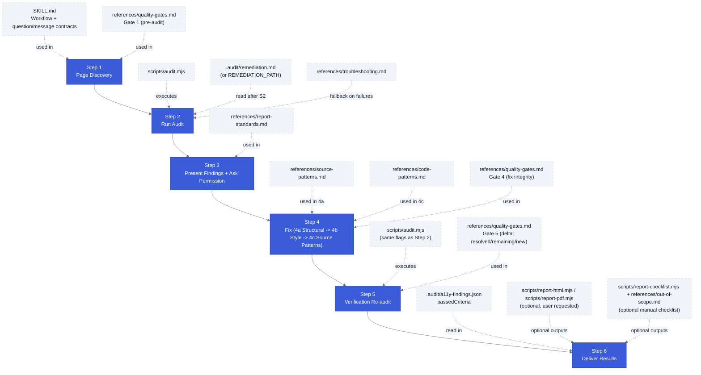
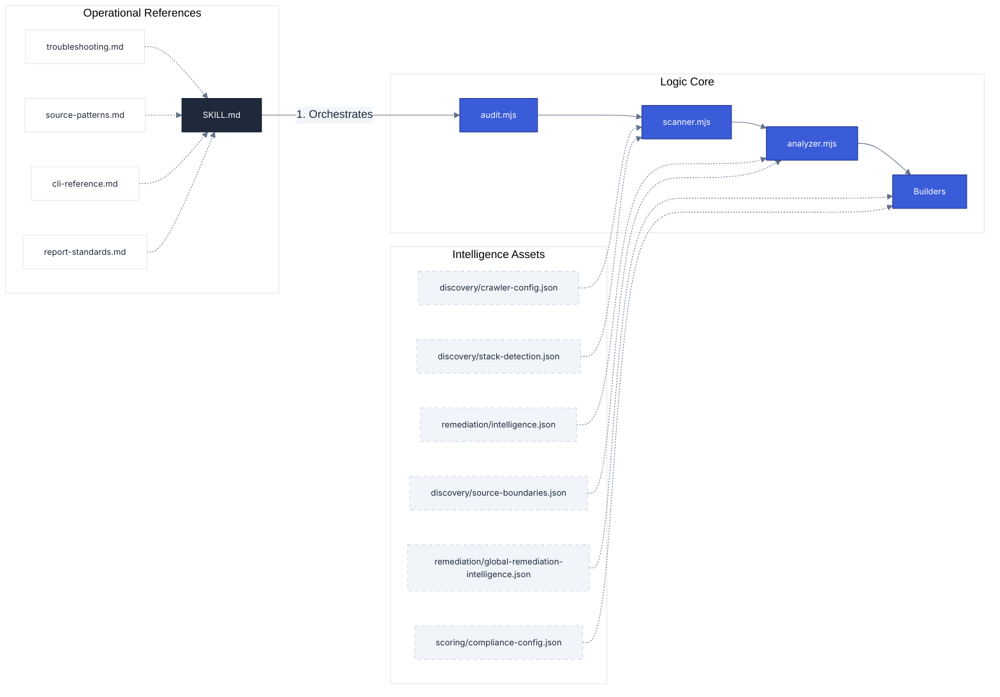

# Engine Manifest

**Navigation**: [Home](../README.md) • [Architecture](architecture.md) • [CLI Handbook](cli-handbook.md) • [Intelligence](engine-intelligence.md) • [Scoring](scoring-system.md) • [Manifest](engine-manifest.md) • [Testing](testing.md)

---

This manifest serves as the **Single Source of Truth** for the a11y skill's technical composition. It unifies logic (scripts), intelligence (assets), and execution standards (references) into a single technical inventory.

## 1. Logic Inventory (Scripts)

The core engine is a three-stage pipeline designed for **Autonomous Remediation**. For deep-dives into execution flow, see [Architecture](architecture.md).

### The Orchestrator

- **`scripts/audit.mjs`**: The master controller. Manages CLI arguments, dependency health, and coordinates the scanner → analyzer → builder flow.

### Core Engine

- **`scripts/scanner.mjs`**: The "Eyes". Powered by Playwright and Axe-core. Handles browser emulation, route discovery (Crawling/Sitemap), and parallel DOM analysis.
- **`scripts/analyzer.mjs`**: The "Brain". Consumes raw results and enriches them with intelligence data to generate surgical fix roadmaps.

### Rendering Engine

- **`scripts/report-html.mjs`**: Generates the interactive audit dashboard.
- **`scripts/report-checklist.mjs`**: Generates the standalone manual testing checklist (`checklist.html`). Reads `assets/reporting/manual-checks.json` directly — no scan input required.
- **`scripts/report-md.mjs`**: Creates the `remediation.md` guide used by AI agents.
- **`scripts/report-pdf.mjs`**: Produces formal executive summaries.
- **`scripts/renderers/`**: Modular rendering logic (`html.mjs`, `md.mjs`, `pdf.mjs`), core data normalization (`findings.mjs`), and shared rendering utilities (`utils.mjs`).

### Infrastructure

- **`scripts/utils.mjs`**: Shared utilities for path resolution, logging, and JSON I/O.
- **`scripts/toolchain.mjs`**: Environment diagnostic utility.

---

## 2. Intelligence Inventory (Assets)

These JSON assets define the "IQ" of the skill. They are read by the **Analyzer** and **Builders** to provide accurate remediation advice.

| Asset                       | Role          | Key Data                                                                             |
| :-------------------------- | :------------ | :----------------------------------------------------------------------------------- |
| **`assets/discovery/stack-detection.json`** | Detection | Framework package detectors, platform structure detectors, and UI library package detectors. |
| **`assets/discovery/source-boundaries.json`** | Source Discovery | Stack-specific editable source boundaries used to suggest safe search locations. |
| **`assets/discovery/crawler-config.json`** | Crawl Rules | Blocked file extensions and pagination query hints used during route discovery. |
| **`assets/remediation/intelligence.json`** | Fix Database | Category, resolution code, framework/CMS notes, guardrails, managed-library flags, and related rules for all 101 axe-core rules. |
| **`assets/remediation/global-remediation-intelligence.json`** | Operating Rules | Shared and platform-specific global instructions injected into the remediation guide. |
| **`assets/scoring/wcag-reference.json`** | Rule Mapping | WCAG criterion links, APG pattern IDs, MDN references, and persona impact tags. |
| **`assets/scoring/compliance-config.json`** | Risk Engine | Severity scoring, grade thresholds, effort multipliers, and jurisdictional data. |
| **`assets/reporting/manual-checks.json`** | Verification | 41 manual audit criteria for WCAG 2.2 areas that automation cannot detect. |

---

## 3. Knowledge Inventory (References)

These Markdown guides define the **Operational Standards** that the AI Agent follows during a live audit.

| Reference                 | Purpose                                                                          |
| :------------------------ | :------------------------------------------------------------------------------- |
| **`cli-reference.md`**    | Targeted Audit command guide (flags, viewports, theme emulation).                |
| **`report-standards.md`** | Internal standards for finding fields, deliverable order, and file storage.      |
| **`source-patterns.md`**  | Framework-specific source file patterns (Next.js, Shopify Liquid, Drupal, etc.) used to locate files during fixing. |
| **`code-patterns.md`**    | Four regex patterns for source-only issues axe-core cannot detect at runtime (focus suppression, autoplay, orientation lock, accesskey). |
| **`quality-gates.md`**    | Pass/fail criteria for each pipeline phase — used to verify gate transitions.    |
| **`out-of-scope.md`**     | WCAG 2.2 AA criteria that require human testing; drives the manual checklist export. |
| **`troubleshooting.md`**  | Self-correction guide for network timeouts, auth errors, and toolchain failures. |

---

## 4. Skill Orchestration (The Playbook)

| File           | Role                                                                                                                                                            |
| :------------- | :-------------------------------------------------------------------------------------------------------------------------------------------------------------- |
| **`SKILL.md`** | The **Agent Playbook**. It contains the 6-step workflow, communication rules, and "Verbatim" messages that orchestrate the entire engine during a conversation. |

---

## 5. Step-by-Step Conversation Flow (with files)

---

## Technical Linkage Map

