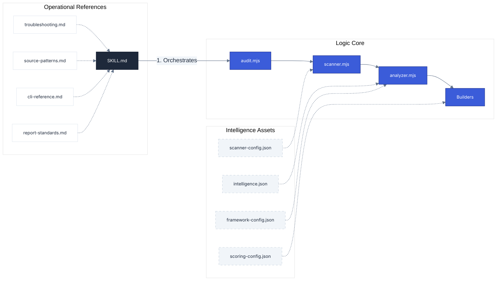

# Engine Manifest

**Navigation**: [Home](../README.md) • [Architecture](architecture.md) • [CLI Handbook](cli-handbook.md) • [Intelligence](engine-intelligence.md) • [Scoring](scoring-system.md) • [Manifest](engine-manifest.md) • [Testing](testing.md)

---

This manifest serves as the **Single Source of Truth** for the a11y skill's technical composition. It unifies logic (scripts), intelligence (assets), and execution standards (references) into a single technical inventory.

## 1. Logic Inventory (Scripts)

The core engine is a three-stage pipeline designed for **Autonomous Remediation**. For deep-dives into execution flow, see [Architecture](architecture.md).

### The Orchestrator

- **`scripts/audit.mjs`**: The master controller. Manages CLI arguments, dependency health, and coordinates the scanner → analyzer → builder flow.

### Core Engine

- **`scripts/scanner.mjs`**: The "Eyes". Powered by Playwright and Axe-core. Handles browser emulation, route discovery (Crawling/Sitemap), and parallel DOM analysis.
- **`scripts/analyzer.mjs`**: The "Brain". Consumes raw results and enriches them with intelligence data to generate surgical fix roadmaps.

### Rendering Engine

- **`scripts/report-html.mjs`**: Generates the interactive dashboard.
- **`scripts/report-md.mjs`**: Creates the `remediation.md` logic used by AI agents.
- **`scripts/report-pdf.mjs`**: Produces formal executive summaries.
- **`scripts/renderers/`**: Modular rendering logic (`html.mjs`, `md.mjs`, `pdf.mjs`), core data normalization (`findings.mjs`), and shared rendering utilities (`utils.mjs`).

### Infrastructure

- **`scripts/utils.mjs`**: Shared utilities for path resolution, logging, and JSON I/O.
- **`scripts/toolchain.mjs`**: Environment diagnostic utility.

---

## 2. Intelligence Inventory (Assets)

These JSON assets define the "IQ" of the skill. They are read by the **Analyzer** and **Builders** to provide accurate remediation advice.

| Asset                       | Role          | Key Data                                                                             |
| :-------------------------- | :------------ | :----------------------------------------------------------------------------------- |
| **`intelligence.json`**     | Fix Database  | Resolution code patterns, framework-specific fix notes, and related rules.           |
| **`rule-metadata.json`**    | Rule Mapping  | WCAG criterion links, APG pattern IDs, MDN references, and persona impact tags.      |
| **`manual-checks.json`**    | Verification  | 42 manual audit criteria for WCAG 2.2 areas that automation cannot detect.           |
| **`scoring-config.json`**   | Risk Engine   | Severity order, penalty weights, grade thresholds, and effort multipliers.           |
| **`framework-config.json`** | Environment   | Dom signals for auto-detection (React, Shopify, etc.) and file-search glob patterns. |
| **`scanner-config.json`**   | Filter Engine | Blocked file extensions, excluded external domains, and robots.txt settings.         |
| **`regulatory.json`**       | Compliance    | Jurisdictional data for ADA (US), EAA (EU), and Section 508.                         |

---

## 3. Knowledge Inventory (References)

These Markdown guides define the **Operational Standards** that the AI Agent follows during a live audit.

| Reference                 | Purpose                                                                          |
| :------------------------ | :------------------------------------------------------------------------------- |
| **`cli-reference.md`**    | Targeted Audit command guide (flags, viewports, theme emulation).                |
| **`report-standards.md`** | Internal standards for finding fields, deliverable order, and file storage.      |
| **`source-patterns.md`**  | Framework-specific search patterns (Next.js, Shopify Liquid, Vue, etc.).         |
| **`troubleshooting.md`**  | Self-correction guide for network timeouts, auth errors, and toolchain failures. |

---

## 4. Skill Orchestration (The Playbook)

| File           | Role                                                                                                                                                            |
| :------------- | :-------------------------------------------------------------------------------------------------------------------------------------------------------------- |
| **`SKILL.md`** | The **Agent Playbook**. It contains the 6-step workflow, communication rules, and "Verbatim" messages that orchestrate the entire engine during a conversation. |

---

## Technical Linkage Map

