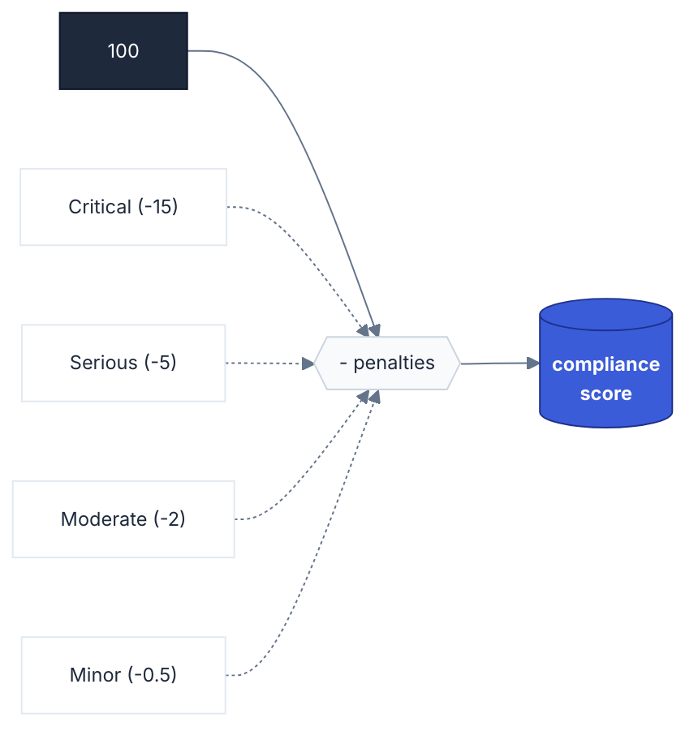

# Scoring System

**Navigation**: [Home](../README.md) • [Architecture](architecture.md) • [CLI Handbook](cli-handbook.md) • [Intelligence](engine-intelligence.md) • [Scoring](scoring-system.md) • [Manifest](engine-manifest.md) • [Testing](testing.md)

---

## Table of Contents

- [Penalty Weights](#penalty-weights)
- [The Formula](#the-formula)
- [Grade Thresholds](#grade-thresholds)
- [WCAG Overall Status](#wcag-overall-status)
- [Calculation Logic](#calculation-logic-scriptsrenderersfindingsmjs)

The a11y skill uses a **Weighted Debt Model** to calculate the Compliance Score. Instead of a simple percentage of passed rules, it penalizes the score based on the severity and frequency of issues.



## Penalty Weights

Each accessibility finding subtracts points from a perfect starting score of **100**.

| Severity     | Penalty    | Description                                         |
| :----------- | :--------- | :-------------------------------------------------- |
| **Critical** | `-15 pts`  | Blockers that prevent users from completing a task. |
| **Serious**  | `-5 pts`   | Significant barriers that impair the experience.    |
| **Moderate** | `-2 pts`   | Noticeable barriers with available workarounds.     |
| **Minor**    | `-0.5 pts` | Best practices or minor inconsistencies.            |

## The Formula

The engine calculates the total penalty across all unique findings and clamps the final score between **0** and **100**.

```text
Final Score = Max(0, 100 - Total_Penalties)
```

> [!NOTE]
> Minor severity findings do reduce the score (-0.5 pts each). A site with 20 Minor findings loses 10 points. Prioritize Critical and Serious issues first, but Minor findings still accumulate debt.

## Grade Thresholds

The score is mapped to a letter grade for quick stakeholder communication:

| Score        | Grade         | Technical Health               |
| :----------- | :------------ | :----------------------------- |
| **90 - 100** | **Excellent** | Compliance Target Met          |
| **75 - 89**  | **Good**      | Minor remediation needed       |
| **55 - 74**  | **Fair**      | Noticeable barriers present    |
| **35 - 54**  | **Poor**      | Significant accessibility debt |
| **0 - 34**   | **Critical**  | Critical blockers detected     |

## WCAG Overall Status

The Compliance Score is a **continuous metric** (0–100). The **WCAG Overall Status** is a separate **binary assessment** that gates report colors in the HTML and PDF outputs (`scripts/renderers/findings.mjs → wcagOverallStatus()`).

| Status | Condition |
| :--- | :--- |
| **Fail** | Any Critical or Serious finding remains |
| **Conditional Pass** | Only Moderate or Minor findings remain |
| **Pass** | Zero findings across all severities |

> [!IMPORTANT]
> Report colors are driven by WCAG Overall Status, **not** by the Compliance Score. A site with a 90/100 score that still has one Critical finding will render **red** in both the HTML and PDF reports. The score and status are independent metrics — the score measures accumulated debt; the status measures WCAG binary conformance.

## Calculation Logic (`scripts/renderers/findings.mjs`)

1. **Grouping**: Multiple DOM instances of the same rule violation on a given route are grouped into one finding (with evidence showing up to 3 instances). Each unique rule-per-route counts as one penalty unit.
2. **Weighting**: Each unique finding's severity is matched against the penalty table.
3. **Subtraction**: The cumulative penalty is subtracted from 100.
4. **Clamping**: Total penalties are subtracted and the result is clamped between 0 and 100.
