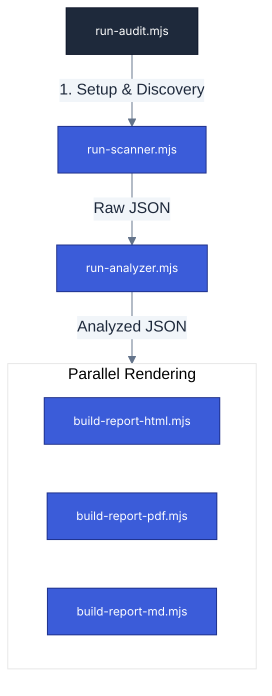

# Scripts Catalog & Workflow

**Navigation**: [Home](../README.md) • [Architecture](architecture.md) • [CLI Handbook](cli-handbook.md) • [Intelligence](engine-intelligence.md) • [Scoring](scoring-system.md) • [Scripts](scripts-catalog.md) • [Testing](testing.md)

---

This document provides a technical overview of all scripts in the `scripts/` directory, organized by their role and execution sequence.

## Execution Workflow

When you trigger an audit (e.g., `pnpm a11y`), the engine follows a three-stage linear pipeline with a parallel reporting finale:

---

## Script Details

### 1. The Orchestrator

- **`run-audit.mjs`**: The main entry point. Coordinates the lifecycle: dependency installation, toolchain verification, scanner execution, and parallel report building.

### 2. Core Scanners

- **`run-scanner.mjs`**: The "Eyes". Powered by Playwright and Axe-core. Performs browser emulation (Viewport, Dark Mode), BFS crawling (or Sitemap discovery), and parallel route scanning.
- **`run-analyzer.mjs`**: The "Intelligence". Enriches raw results with `assets/intelligence.json`. It calculates severity tiers, generates "Surgical Selectors", and provides framework-aware fix hints.

### 3. Builders & Rendering Engine

These scripts transform analyzed findings into user-facing formats. They rely on the modular logic in `scripts/report/`.

- **`build-report-html.mjs`**: Generates the interactive dashboard using `format-html.mjs`.
- **`build-report-md.mjs`**: Creates the `remediation.md` guide for AI agents using `format-md.mjs`.
- **`build-report-pdf.mjs`**: Produces high-fidelity summaries using Puppeteer-based rendering and `format-pdf.mjs`.

### 4. Infrastructure & Utilities

- **`a11y-utils.mjs`**: Shared logic for logging, path resolution (`getInternalPath`), JSON I/O, and global configuration defaults.
- **`check-toolchain.mjs`**: Diagnostic script that verifies Node.js versions, Playwright availability, and project-level dependencies.
- **`scripts/report/`**: Contains core normalization logic (`core-findings.mjs`) and shared formatting utilities (`core-utils.mjs`) used across all report formats.
