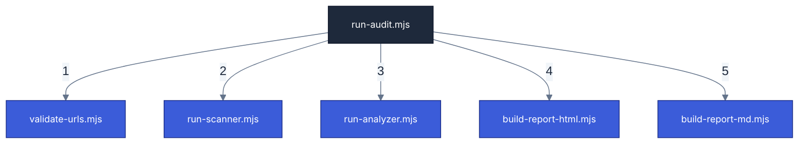

# Scripts Catalog & Workflow

This document provides a technical overview of all scripts in the `scripts/` directory, organized by their role and execution sequence during an audit.

## Execution Workflow

When you trigger an audit (e.g., `pnpm a11y`), the engine follows this linear pipeline:

---

## Script Details

### 1. The Orchestrator

- **`run-audit.mjs`**: The main entry point. It coordinates all other scripts, handles CLI arguments, and manages the overall lifecycle of the audit process.

### 2. Validation & Setup

- **`validate-urls.mjs`**: Pre-scan validation. Checks if the target URLs are reachable and properly formatted before spinning up the browser.
- **`check-toolchain.mjs`**: A diagnostic utility to verify the environment (Node.js version, installed dependencies like Playwright) and troubleshoot installation issues.

### 3. Core Engine

- **`run-scanner.mjs`**: The "Eyes". Uses Playwright and Axe-core to perform the technical scan on the target routes. It generates the raw JSON results with all DOM violations.
- **`run-analyzer.mjs`**: The "Brain". Enriches the raw scan results using the internal Intelligence Database. It generates the "Surgical Selectors" and maps findings to WCAG criteria.

### 4. Reporting & Delivery

- **`build-report-html.mjs`**: The "Designer". Transforms analyzed findings into the interactive HTML dashboard and the executive PDF summary.
- **`build-report-md.mjs`**: The "Communicator". Generates the `remediation.md` guide specifically optimized for AI agents to perform autonomous fixes.

### 5. Shared Libraries

- **`a11y-utils.mjs`**: A collection of shared helper functions for logging, JSON processing, and configuration management used across all scripts.
- **`report/`**: A subdirectory containing the modular logic for formatting findings into different target structures (HTML, MD, PDF).
